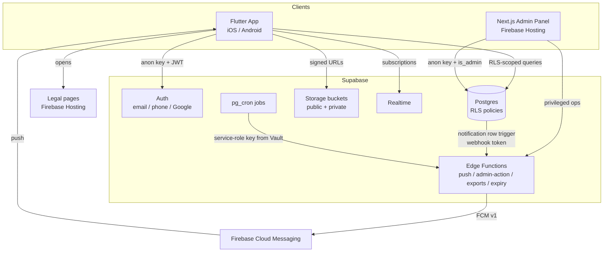

# Architecture Overview

TripsFactory is a logistics marketplace with three deployable surfaces sharing one
Supabase backend. Everything brand/environment-specific is read from
configuration seams or environment variables — there are no hardcoded project
URLs or keys in the code.

## Components

| Surface | Stack | Notes |
|---|---|---|
| **Mobile app** | Flutter (Dart `^3.10.7`), Riverpod, go_router | Feature-first structure under `lib/features/`; theming, localization (5 languages), and geography are config-driven. |
| **Admin panel** | Next.js (static export), Tailwind | Uses the public **anon** key; `is_admin()` + RLS is the security boundary, plus an `admin-action` Edge Function for privileged operations. Deployed to Firebase Hosting. |
| **Backend** | Supabase: Postgres + Auth + Storage + Realtime + Edge Functions (Deno) + pg_cron | Single baseline schema migration; RLS-enforced; push via a dedicated webhook token. |
| **Push / hosting** | Firebase Cloud Messaging + Firebase Hosting | FCM v1 via a service-account secret; Hosting serves the admin console + legal pages. |

## System diagram

## Request / security model

- **Anon key is public** (bundled in the app). Every read/write is gated by
  **Row-Level Security** in Postgres — the anon key alone grants nothing beyond
  what RLS allows for the authenticated user.
- **Admin privileges** are a single flag (`profiles.is_admin`) enforced by RLS
  and `is_admin()`. The admin panel never uses a service-role key in the browser;
  privileged actions go through the `admin-action` Edge Function.
- **Push notifications**: a Postgres trigger on new notification rows calls the
  `push-notification` Edge Function, authenticated by a dedicated
  `PUSH_WEBHOOK_TOKEN` (not a platform key). The function sends via FCM v1 using
  a Firebase service-account secret.
- **Scheduled work** (trip expiry, export processing) runs as pg_cron jobs that
  read the service-role key from Supabase Vault.

## Configuration seams (white-label)

| Concern | Where |
|---|---|
| Brand (name, colors, URLs) | `lib/core/config/brand_config.dart` (+ `fork.config.json`) |
| Languages (supported + default) | `lib/core/config/localization_config.dart` |
| Themes / fonts | `AppTheme.supportedThemes`, `ThemeNotifier`, `lib/core/config/font_config.dart` |
| Home country (internal vs external routes, ISO code) | `lib/core/config/geography_config.dart` + admin `geographyConfig.ts` + `is_home_country` (SQL) |
| Storage bucket names | `lib/core/config/storage_buckets.dart` |
| Backend URLs / keys | environment variables (`.env`, `admin/.env.local`) |

See `CORE.md` for the full rebrand procedure and `docs/GETTING_STARTED.md` for
the from-scratch setup.
